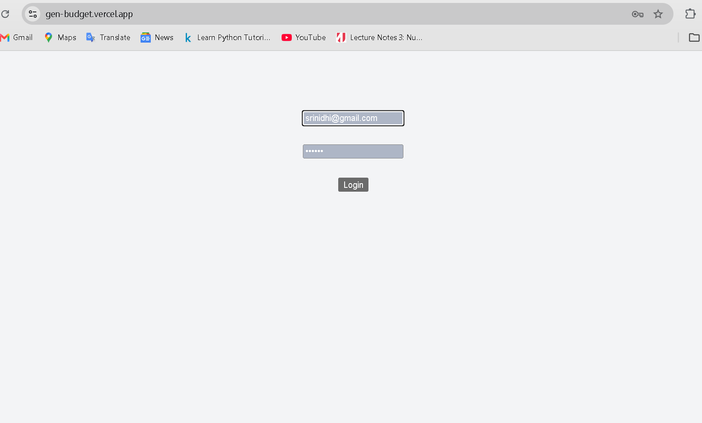
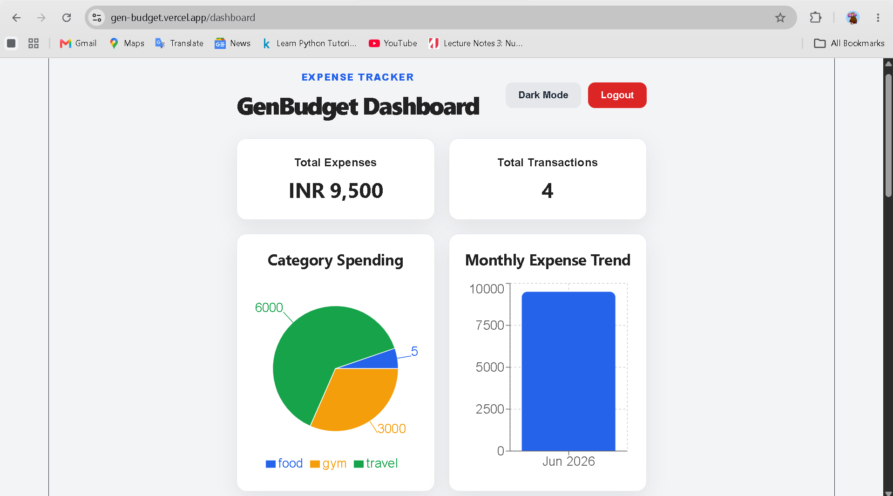
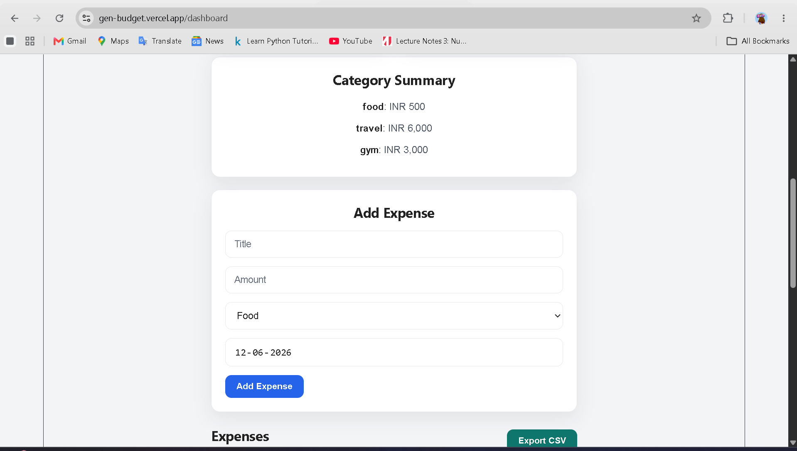
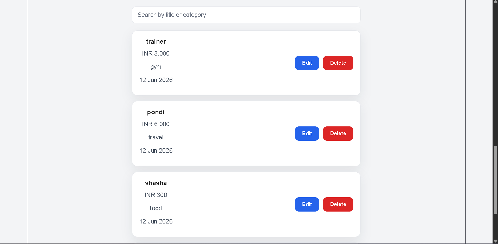

GenBudget

GenBudget is a full-stack personal finance management application designed to help users track expenses, visualize spending patterns, and manage budgets effectively through an interactive dashboard.

Live Demo:
Frontend: https://gen-budget.vercel.app
Backend API: https://genbudget.onrender.com

Features:
User Registration & Login
JWT Authentication
Secure Password Hashing
Add, Edit, and Delete Expenses
Category-wise Expense Tracking
Monthly Expense Visualization
Interactive Dashboard
Responsive User Interface
MongoDB Database Integration

Tech Stack:
Frontend
React.js
Vite
Axios
Chart.js
CSS
Backend
Node.js
Express.js
JWT Authentication
bcryptjs
Database
MongoDB Atlas
Mongoose
Deployment
Vercel (Frontend)
Render (Backend)

Project Structure:
GenBudget/
│
├── frontend/
│   ├── src/
│   ├── public/
│   └── package.json
│
├── backend/
│   ├── controllers/
│   ├── routes/
│   ├── models/
│   ├── middleware/
│   ├── config/
│   └── package.json
│
└── README.md

Authentication:
The application uses:
JWT (JSON Web Tokens)
Protected Routes
Password Hashing using bcryptjs

Dashboard Features:
Expense Summary
Category Spending Analysis
Monthly Expense Trends
User-specific Data Management

Screenshots:
Add screenshots here after capturing them.

Login Page

Dashboard

Installation:
Clone Repository
git clone https://github.com/nidhi2708/GenBudget.git

Backend Setup:
cd backend
npm install
npm start

Frontend Setup:
cd frontend
npm install
npm run dev
Environment Variables

Create a .env file inside the backend folder:
MONGO_URI=your_mongodb_uri
JWT_SECRET=your_secret_key
PORT=5000

Future Enhancements:
Budget Goals
Income Tracking
Expense Export (PDF/Excel)
AI-Based Spending Insights
Email Notifications

Author:
Srinidhi Gadde
